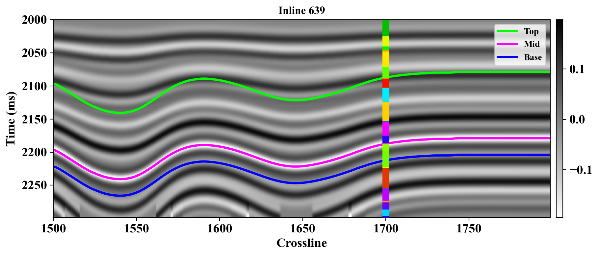
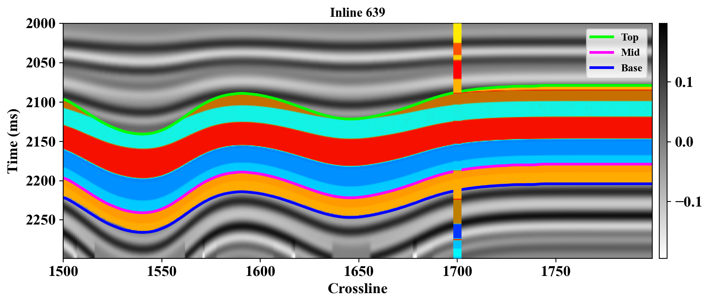
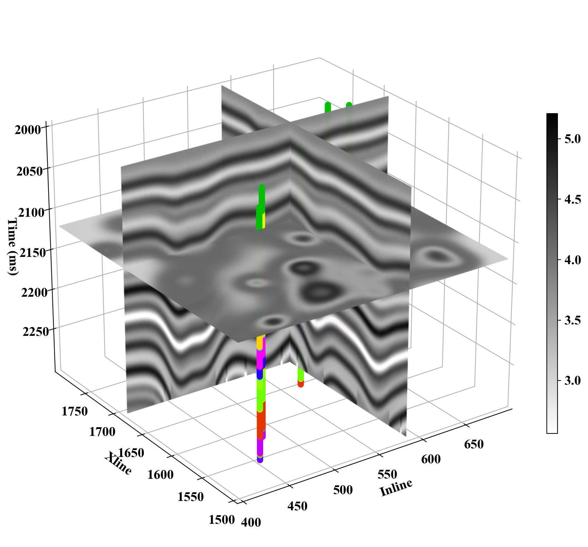

# SeisVis - Seismic Data Visualization Library


A simple and easy-to-use Python library for seismic data visualization, designed for geophysicists and seismic data analysts.

The motivation behind developing **SeisVis** is to **reduce repetitive plotting code during paper writing** and to **enable customized figure generation directly in Python**. With SeisVis, users can create high-quality static plots in their preferred style **without the need to open and manipulate data in heavy software platforms**.


## 🌟 Features

- **Easy to Use**: Minimal API design - create professional seismic visualizations with just a few lines of code
- **Lightweight Dependencies**: Only requires matplotlib - no complex environment setup needed
- **Full Dimensional Support**: Supports 1D, 2D, and 3D seismic data visualization
- **Unified Data Management**: Built-in DataCube class for managing seismic data, properties, horizons, and well logs
- **Professional Color Schemes**: Built-in OpendTect-compatible seismic color maps
- **Flexible Configuration**: Customizable plotting parameters and styling options

## 🚀 Quick Start

### Installation

```bash
pip install seisvis
```

### Basic Usage
#### 1D Seismic Plotting
```bash
from seisvis import plot1d
from seisvis.config import PlotConfig
import numpy as np

# Create configuration
config1d = PlotConfig()
config1d.label_fontsize = 18
config1d.tick_labelsize = 18

# Initialize plotter
plotter1d = plot1d.Seis1DPlotter(config1d)

# Create sample data (replace with your actual data)
data_groups = [
    [np.random.randn(100) for _ in range(4)],  # Vp curves
    [np.random.randn(100) for _ in range(4)],  # Vs curves
    [np.random.randn(100) for _ in range(4)],  # Rho curves
]

titles = ['Vp', 'Vs', 'Rho']
legends = ['True', 'LowFreq', 'Method1', 'Method2']

# Plot vertical layout
plotter1d.plot_groups(data_groups=data_groups,
                      figsize=(4, 15),
                      t_start=0,
                      titles=titles,
                      legends=legends)
```
#### 2D/3D Seismic Visualization with DataCube
This is just a demonstration; for more details, please refer to [`vis_demo.ipynb`](./vis_demo.ipynb).

```bash
from seisvis.datacube import DataCube
from seisvis import plot2d， plot3d

# Initialize DataCube
data_cube = DataCube()

# Add your data
data_cube.add_seismic("Seis1", seismic_data)
data_cube.add_property("Prop1", property_data)
data_cube.add_horizon("Top", top_horizon)
data_cube.add_horizon("Base", top_horizon)
data_cube.add_well("Well-1", well_data)
data_cube.add_well("Well-2", well_data)

# 2D Section Plotting
config2d = PlotConfig()
size = [il_start, il_end, xl_start, xl_end, t_end, t_start]
plotter2d = plot2d.Seis2DPlotter(data_cube, size, config2d)

# Configure display settings
show_seismic = {'type':'Seis1', 'cmap':'Grey_scales', 'clip':'robust', 'mask':False, 'bar':True}
show_properties = {'type':'Prop1', 'cmap':'AI', 'clip':'robust', 'mask':True, 'bar':False}
show_horizons = {'type':['Top', 'Base'], 'cmap':None, 'clip':None}
show_wells = {'type':['Well-1', 'Well-2'], 'cmap':'AI', 'clip':None, 'width':4}

# Plot inline section
plotter2d.plot_section(section_idx=639, section_type='inline',
                       show_seismic_type=show_seismic,
                       show_properties_type=show_properties,
                       show_horizons_type=show_horizons,
                       show_wells_type=show_wells)

# 3D Visualization
config3d = PlotConfig()
config3d.label_fontsize=14
config3d.tick_labelsize=14
plotter3d = plot3d.Seis3DPlotter(data_cube, size, config3d)
plotter3d.plot_slices(show_seismic_type=show_seismic,
                      show_wells_type=show_wells)
 ```
**Example Outputs:**

- *2D Inline Section with Horizons and Wells*  
  

- *2D Inline Section with Masked Properties and Wells*  
  

- *3D Seismic Slices with Well Overlay*  
  

## 📊 Main Components

#### 1. 1D Plotting (plot1d)

- Multi-curve comparison plotting
- Vertical and horizontal layout options

#### 2. 2D Plotting (plot2d)

- Inline and crossline section visualization
- Seismic amplitude and property overlay
- Horizon and well trajectory display

#### 3. 3D Plotting (plot3d)

- 3D seismic volume slicing
- Well trajectory in 3D space
- Static 3D rendering (interactive features planned)

#### 4. DataCube Management

- Unified data container for seismic projects
- Support for multiple seismic volumes
- Horizon and well data integration
- Easy data organization and access

## 🔧 Current Limitations

- 3D Visualization: Currently supports static 3D plots only 

## 📚 Test Data
Sample datasets are available for testing:
[Google Drive - seisvis Test Data](https://drive.google.com/drive/folders/1IY6pkdu4o7M7jgoc5ILKwJagQ82bZkfx?usp=drive_link)


## 🙏 Acknowledgments
This project leverages open-source resources and colormaps from:
- [Matplotlib](https://matplotlib.org/)
- [OpendtectColormaps](https://github.com/whimian/OpendtectColormaps)
  
We gratefully acknowledge the contributors of these libraries for their valuable tools and visual assets, which enhance the clarity and quality of seismic interpretation.